# Objetivos de la repositorio

Este proyecto se encarga de manejar los planes de la liga de la justicia

Lorem ipsum dolor sit amet, consectetur adipisicing elit, sed do eiusmod tempor incididunt ut labore et dolore magna aliqua. Ut enim ad minim veniam, quis nostrud exercitation ullamco laboris nisi ut aliquip ex ea commodo consequat. Duis aute irure dolor in reprehenderit in voluptate velit esse cillum dolore eu fugiat nulla pariatur. Excepteur sint occaecat cupidatat non proident, sunt in culpa qui officia deserunt mollit anim id est laborum.

```mermaid
flowchart LR
    subgraph API_Gateway ["API Gateway"]
        GW[Gateway - Enrutamiento y Seguridad]
    end

    subgraph AuthService ["Auth Service"]
        AUTH[Autenticación]
    end

    subgraph UserService ["User Service"]
        USER[Usuarios]
    end

    subgraph OrderService ["Order Service"]
        ORDER[Pedidos]
    end

    subgraph InventoryService ["Inventory Service"]
        INV[Inventario]
    end

    subgraph Broker ["Message Broker"]
        EVT[(Eventos)]
    end

    GW --> AUTH
    GW --> USER
    GW --> ORDER
    GW --> INV

    ORDER --> EVT
    INV --> EVT
    EVT --> ORDER
    EVT --> INV
```

| Clave | Cantidad | Signo | id_transaccion |
|-------|---------:|------:|----------------|
| 001   | 10       | -1    | D001           |
| 002   | 30       | -1    | D002           |
| 003   | 5        | 1     | D003           |
| 001   | 3        | 1     | D004           |
